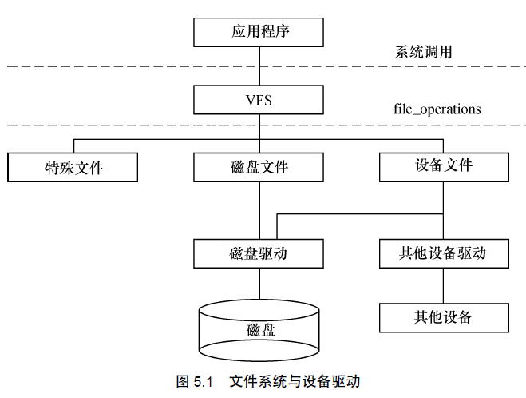

### 概念
```
linux一切皆文件， 虚拟文件系统是一切文件系统的接口，内核与实际的文件系统是通过这些接口来交流的
```

### 虚拟文件系统
(1) 结构
```
                           应用程序
----------------------------------------------------------------------------系统调用
                             VFS
----------------------------------------------------------------------------File_operations
特殊文件（/proc，/sys）     磁盘文件系统       其他设备文件（/dev/tty1,/dev/sdb1，网络）
                               |                   |
                            磁盘驱动           其他设备驱动
                               |                   |
                              磁盘                网卡等
```

(2) VFS对象结构
```
//VFS对象及数据结构
超级快对象：代表一个具体的已安装的文件系统
索引节点对象：代表一个具体的文件
目录项对象 ：代表一个目录项，是路径的一个组成部分（不同于目录，目录是另一种形式的文件）
文件对象：表示今进程已经打开的文件

//和VFS文件系统相关的数据结构
file_system_type、vfsmount

//和进程相关的数据结构
每个进程都有自己一组打开的文件，file_struct、fs_struct、namespace

proc文件系统，它使得内核可以生成与系统状态和配置有关的信息，这些信息可以由用户和系统程序从普通文件读取，而无需要专门的内核通信。
proc利用虚拟文件系统“即时”产生信息
/proc/pid   当前运行的进程id
/proc/devices 文件可以获知系统中注册的设备
/dev 目录可以获知系统中包含的设备文件 前两列分别给出了主设备号和次设备号。
```

(3)vfs是所有文件系统的基类
```
vfs是所有文件系统的公共接口（最小接口），可以理解为fs的（抽象）基类；而具体的fs，例如ext2/nfts，则是vfs的一种具体实现（也可以理解为子类）。

VFS(虚拟文件系统)是面向内核的，设备文件系统是vfs和硬件之间的桥梁
基类    实现
vfs --> Ext2
        sysfs
        FAT
        设备文件
        网络文件

VFS所支持的文件系统类型可以归结为以下三大类：
    基于磁盘的文件系统(Ext2, Ext3等)
    网络文件系统(NFS等)
    特殊文件系统(proc, sysfs)

总结：
            vfs的实现
    内核 -> 虚拟文件系统（sysfs,proc,ext4）-> 设备驱动 -> 设备

他们之间的关系，如图：
```



### 内存文件系统
```

```


