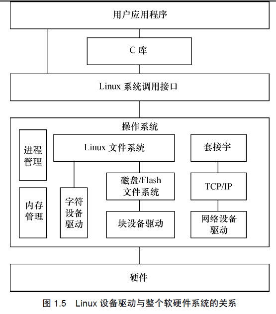
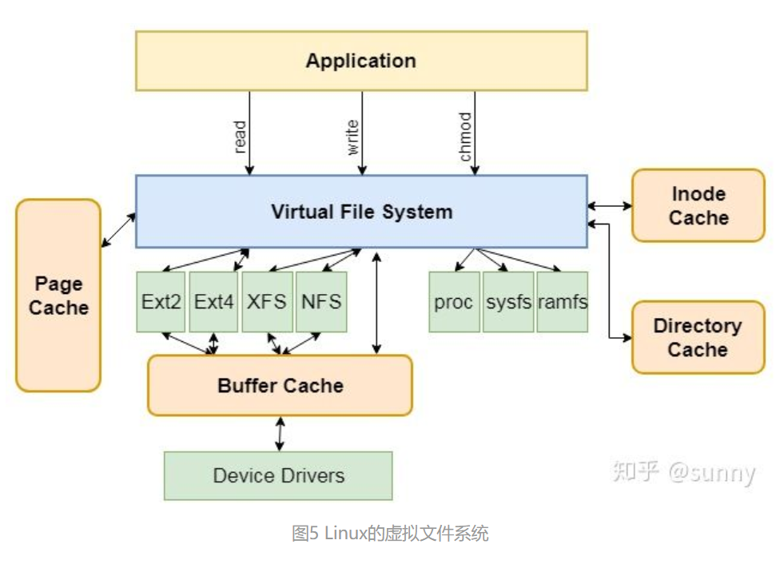

### 总览
```
内核-->设备驱动-->硬件驱动-->硬件
```

### 驱动
1、Linux 设备驱动
```
字符设备；  
块设备；    FAT、EXT4...
网络设备:   
```

2、Linux 设备驱动与整个软硬件系统的关系


3、虚拟文件系统
```
VFS(虚拟文件系统)是面向内核的，设备文件系统是vfs和硬件之间的桥梁
vfs --> Ext2
        FAT
        设备文件
        网络文件

相关对象
超级快对象
索引节点对象
文件对象
目录项对象
```

之间的关系


4、Linux 系统中虚拟文件系统、硬件文件及一般的设备文件与设备驱动程序之间的关系


5、设备文件系统
```
设备文件系统就是对设备初始化时创建设备文件，设备驱动程序可以指定设备号、所有者、用户空间等信息
就是用来对设备进行管理的一种文件系统

devfs（旧）、sysfs（用户空间）
udev是一种工作在用户空间工具，根据系统中的硬件设备的状况动态更新设备文件，包括设备文件的创建，删除等。需要内核sysfs和tmpfs的支持，sysfs为udev提供设备入口和uevent通道，tmpfs为udev设备文件提供存放空间。

udev从kernel中收到一个设备的uevent ---> 添加设备的uevent ---> 


```

### 文件系统
```
在Linux中，一切你看到的皆为文件
目录:由其他文件组成的文件
特殊文件:用于输入和输出的途径。大多数特殊文件都储存在/dev中，我们将会在后面讨论这个问题。
链接文件:让文件或者目录出现在系统文件树结构上多个地方的机制。我们将详细地讨论这个链接文件。
(域)套接字:特殊的文件类型，和TCP/IP协议中的套接字有点像，提供进程间网络通讯，并受文件系统的访问控制机制保护。
命名管道 : 或多或少有点像sockets(套接字)，提供一个进程间的通信机制，而不用网络套接字协议。
```

#### 相关问题
(1)vfs与设备驱动与硬件的关系
(2)内核驱动与用户驱动
(3)内核

#### VFS文件系统
VFS所支持的文件系统类型可以归结为以下三大类：
    基于磁盘的文件系统(Ext2, Ext3等)
    网络文件系统(NFS等)
    特殊文件系统(proc, sysfs)


vfs是所有文件系统的公共接口（最小接口），可以理解为fs的（抽象）基类；而具体的fs，例如ext2/nfts，则是vfs的一种具体实现（也可以理解为子类）。
比如：
```
基类        继承实现            物理
vfs-------> 字符设备驱动 ------>  键盘、文件系统
            块驱动      -------> 文件系统  ----> 磁盘
            网络驱动
                        |
                        需要实现的驱动（把物理设备抽象为 字符设备、块设备、网络设备）
```

比如write(fd, ...)系统调用，在内核里的代码就是调用filp->write(...)，这里的filp不关心文件到底是ext2还是ntfs。
当然，它最终还是会调用到ext2_write或者是ntfs_write。
sysfs是一种具体的fs，跟ext2/nts是平级的，不同的是，它完全只存在于内存里（跟procfs类似）。

udev是一种工具，它能够根据系统中的硬件设备的状况动态更新设备文件，包括设备文件的创建，删除等。设备文件通常放在/dev目录下，使用udev后,在/dev下面只包含系统中真实存在的设备。它于硬件平台无关的，位于用户空间，需要内核sysfs和tmpfs的支持，sysfs为udev提供设备入口和uevent通道，tmpfs为udev设备文件提供存放空间。


#### io层

1、
随机读取：块设备（硬盘）
顺序读取：字符设备（键盘）
2、
块设备最小的寻址单元是扇区（2^n 512）
内核按块，磁盘按区

(1) buffer_head
内存一次读取一个块，一个块包含多个扇区，一个页可容纳多个块
一个快对应一个缓冲区
缓冲区头表示磁盘块与物理内存的映射
```
struct buffer_head {
    unsigned long b_state;        /* buffer state bitmap (see above) *缓冲区的状态标志/
    struct buffer_head *b_this_page;/* circular list of page's buffers *页面中缓冲区/
    struct page *b_page;        /* the page this bh is mapped to *存储缓冲区的页面/

    sector_t b_blocknr;        /* start block number *逻辑块号/
    size_t b_size;            /* size of mapping *块大小/
    char *b_data;            /* pointer to data within the page *指向页面中数据的指针/

    struct block_device *b_bdev;       //对应的块设备
    bh_end_io_t *b_end_io;              /* I/O completion */
     void *b_private;                   /* reserved for b_end_io *I/O完成的方法/
    struct list_head b_assoc_buffers;   /* associated with another mapping */
    struct address_space *b_assoc_map;    /* mapping this buffer is
                                    associated with *缓冲区对应的映射，即address_space/
    atomic_t b_count;        /* users using this buffer_head *表示缓冲区的使用计数/
};
```

(2) bio结构
链表的形式可以保证不同的相连


#### 字符设备
(1)设备编号
```
//静态分配
int register_chrdev_region(dev_t first, unsigned int count, char *name);
    //count 是你请求的连续设备编号的总数. 注意, 如果count 太大, 你要求的范围可能溢出到下一个次编号
    //name 是应当连接到这个编号范围的设备的名子

//动态分配
int alloc_chrdev_region(dev_t *dev, unsigned int firstminor, unsigned int count, char *name);

//如果分配成功，返回0
//设备编号会出现在/proc/devices和sysfs中

//清除设备号
void unregister_chrdev_region(dev_t first, unsigned int count);

```

(2)模块加载
```
//加载模块(scull)
insmod scull.ko 
//根据生成的主设备号创建设备节点,比如主设备号是100
mknod /dev/scull0 c 100 0   //创建第一个设备
mknod /dev/scull1 c 100 1   //创建第二个设备
//change the group and mode
chgrp $group /dev/${device}[0-3]
chmod $mode /dev/${device}[0-3]

```

(3)关键结构
```
struct file_operations scull_fops = {
.owner = THIS_MODULE,
.llseek = scull_llseek,
.read = scull_read,
.write = scull_write,
.ioctl = scull_ioctl,
.open = scull_open,
.release = scull_release,
}

struct file 
{
mode_t f_mode;
loff_t f_pos;
unsigned int f_flags;
struct file_operations *f_op;
void *private_data;
struct dentry *f_dentry;  --> d_inode
}

struct inode
{
dev_t i_rdev;
struct cdev *i_cdev;

}

```

(4)字符设备注册
```
#include <linux/cdev.h>
//类似这样
struct cdev *my_cdev = cdev_alloc();
my_cdev->ops = &my_fops;

//初始化
void cdev_init(struct cdev *cdev, struct file_operations *fops);
//关联设备
int cdev_add(struct cdev *dev, dev_t num, unsigned int count);
    //num 是这个设备响应的第一个设备号
    //count 是应当关联到设备的设备号的数目. 常常 count 是 1, 但是有多个设备号对应于一个特定的设备的情形
//去除一个字符设备
void cdev_del(struct cdev *dev);
    //你不应当在传递给 cdev_del 后存取 cdev 结构
//核心代码
cdev_init(&dev->cdev, &scull_fops);
dev->cdev.owner = THIS_MODULE;
dev->cdev.ops = &scull_fops;
err = cdev_add (&dev->cdev, devno, 1);

//以前的初始化代码（早些机制避免使用cdev）
int register_chrdev(unsigned int major, const char *name, struct file_operations *fops);
//老的去除设备代码
int unregister_chrdev(unsigned int major, const char *name);

```

(5)scull结构
```
struct scull_dev {
    struct scull_qset *data; /* Pointer to first quantum set */
    int quantum; /* the current quantum size */
    int qset; /* the current array size */
    unsigned long size; /* amount of data stored here */
    unsigned int access_key; /* used by sculluid and scullpriv */
    struct semaphore sem; /* mutual exclusion semaphore */
    struct cdev cdev; /* Char device structure */
}

struct scull_qset {
    void **data;
    struct scull_qset *next;
};


```

(6)open方法
检查设备特定的错误(例如设备没准备好, 或者类似的硬件错误)
如果它第一次打开, 初始化设备
如果需要, 更新 f_op 指针.
分配并填充要放进 filp->private_data 的任何数据结构
```
int (*open)(struct inode *inode, struct file *filp)

struct scull_dev *dev;
dev = container_of(inode->i_cdev, struct scull_dev, cdev) ; //这是个宏, 后面两个参数是类型 

#define container_of(ptr, type, member) ({              \         
const typeof( ((type *)0)->member ) *__mptr = (ptr);    \         
(type *)( (char *)__mptr - offsetof(type,member) );})


filp->private_date = dev;
if ((filp->f_flags & O_ACCMODE) == O_WEONLY){
    scull_trim(dev);
}

```

(7)read和write
```

```


---
#### 内存文件系统
```

```


