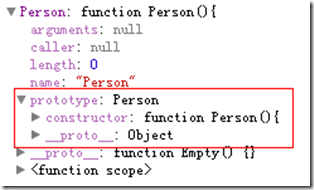

#### 原型
```
(1)js中一切都是对象
(2)方法（Function）是对象，方法的原型(Function.prototype)是对象
(3)对象具有属性__proto__, 可称为隐式原型。实例化对象-->__proto__-->构造函数的原型，保证了能够访问构造函数原型中定义的属性和方法
(4)
```


#### 继承
javascript是基于phototype的，不是基于类的。


```
在 JavaScript 中，不会创建类，也不会通过类来创建对象（就像在其他面向对象的语言中那样）。通过prototype.constructor()来实例化类。
添加内容供实例访问，原型对象包含函数实例共享的方法和属性，其中 prototype.constructor()可以当作函数的构造函数用
实例的__proto__ 指向函数的prototype
prototype可以理解为函数的一个属性，即Object.prototype,他也是实例化的东西
prototype属性中含有两个属性constructor和__proto__
任何对象都有一个__proto__属性 
任何方法都有一个prototype属性，prototype也是一个对象 ，所以其中也有一个__proto__
使用Object.getPrototypeOf()代替__proto__
原型链可以理解为：Object.prototype.__proto__.prototype.__proto__.....
继承是通过原型链一层一层的向上延续（找属性）

```
实例
```
function Person(name){
    this.name=name;     //this代表实例的属性
}

typeof Person.prototype // 'object'

Person.prototype.share=[];   

Person.prototype.printName=function(){
       alert(this.name);
}
var person1=new Person('Byron');
var person2=new Person('Frank');

person1.__proto__ === Person.prototype  //true

typeof person1.__proto__  //'object'

person1.share.push(1);
person2.share.push(2);
console.log(person2.share); //[1,2] 可以理解为prototype创建的对象是全局的。

my = function(){
    this.a = 1;
}
my.b=1;             //注意这里仅仅是个my添加了一个b属性，不影响后续的操作
my.prototype.b=1;
```

原型链

#### new
`var o = new Foo();`
JavaScript 实际上执行的是：
```
var o = new Object();
o.__proto__ = Foo.prototype;
Foo.call(o);

```

#### Object.creat(类似于继承)
```
Object.create =  function (o) { //注意o是一个实例
    var F = function () {};
    F.prototype = o;
    return new F();
};
```

#### 继承的简单实现

**下面的第一个函数表示 subFn构造函数是subFn，但是其他的变成了superFn**
```
function Extend(subFn, superFn){
    subFn.prototype = new superFn()   //注意 prototype 是一个原型对象
    subFn.prototype.constructor = subFn //新定义一个function
}
 
function Animal(){
    this.say1 = function(){
        alert("Animal");
    }
}
 
function Tiger(){
    this.say2 = function(){
        alert("Tiger");
    }
}
 
Extend(Tiger,Animal);
 
var tiger = new Tiger();
tiger.say1();//"Animal"
tiger.say2();//"Tiger"
```
简直精辟！！！！

#### canvas 旋转方法
```
var c=document.getElementById("myCanvas");
var ctx=c.getContext("2d");
var coorX = new Array(10,40,70);	
var coorY = new Array(30,30,30);	
var s = 0;
var tran = {x:[coorX[0]+s/2,coorX[1]+s/2,coorX[2]+s/2],y:[coorY[0]+s/2,coorY[1]+s/2,coorY[2]+s/2]};
console.log(tran.x);
console.log(tran.y);
ctx.font="30px Arial";
ctx.save();
	
ctx.strokeText("H",coorX[0],coorY[0]);	
ctx.translate(tran.x[0],tran.y[0]);
ctx.rotate(20*Math.PI/180);
ctx.translate(-tran.x[0],-tran.y[0]);
ctx.strokeText("H",coorX[0],coorY[0]);
```

#### 静态变量与实例变量
```
function obj(){
    obj.a=0; //类变量
    this.b=1;//实例变量
}
console.log(obj.a);
var my = new obj();
console.log(my.b);
```

#### prototype与__proto__
函数（只有函数）中都有prototype属性，对象具有属性__proto__，可称为隐式原型，一个对象的隐式原型指向构造该对象的构造函数的原型，这也保证了实例能够访问在构造函数原型中定义的属性和方法。
对象具有属性__proto__，可称为隐式原型，一个对象的隐式原型指向构造该对象的构造函数的原型，这也保证了实例能够访问在构造函数原型中定义的属性和方法。
prototype:
constructor:this
\_\_proto\_\_:object
```
var my = function(){}
my.__prototype__.a = 1
my.__prototype__ = new my1();
my.__prototype__ = { 
    .....
}
```

#### 函数默认参数
`var func=function(x,y=2){console.log(x,y);}`

#### instanceof
instanceof 运算符是用来在运行时指出对象是否是特定类的一个实例。

#### 原型的理解
* __proto__
```
var Unical={
    name:'liyi',
    age:31,
    hello:function(){
        alert('Hello, '+this.name+'!');
    }
}
var qinbb={
    name:'qinbb',
    age:24
}
qinbb.__proto__=Unical;
```
原型链：qinbb--->Unical.prototype--->Object.prototype--->null
* 实例
```
function Leader(name){
    this.name=name;
    this.hello=function(){
        alert(this.name+' is a leader !');
    }
}
var liyi= new Leader('liyi');
var qinbb = new Leader('qinbb');
liyi.hello===qinbb.hello;//输出：false 虽然调用同一个函数，但是并不相同 解
Object.getPrototypeOf(liyi);//输出 Object {}
liyi.constructor===Leader.prototype.constructor;//true 
liyi.__proto__===Leader.prototype;//true
Leader.prototype.constructor; //会显示 function Leader(){}
Leader.prototype.run = function(){}
liyi.run === qinbb.run // true
```

---
#### join
```
var a=[]
a.join(';')
```

---
#### querystring
```
querystring.parse('a=3&b=4')
{ a: '3', b: '4' }
```

---
#### JSON
```
a={a:1,b:2}
x= JSON.stringify(a)
y= JSON.parse(x)
```

---
#### trim
去除string前后空字符
```
var a = ' dsaa '
a.trim()
```

---
#### exec正则匹配
```
m = /\d+/
m.exec('42ds')
[ '42', index: 0, input: '42ds', groups: undefined ]
```

---
#### RegExp
```
a=new RegExp('\\w+','i')
/\w+/i
```

---
#### argument
```
function func(){
    console.log(arguments)
}

func(1,2)
//[Arguments] { '0': 1, '1': 2 } 这个虽然是个object,但是它包含length属性
//[Arguments] { '0': 1, '1': 2, 'length' : 2}

Array.prototype.slice.call(arguments,0) //[1,2]
//如果没有length属性的话
a={0:0,1:1}
Array.prototype.slice.call(a,0) //[]
a={0:0,1:1,'length':2}
Array.prototype.slice.call(a,0) //[0,1]
```

---
#### Array操作
```
(1)indexof(查找元素位置)
var arr = ['apple','orange','pear'];
console.log("found:", arr.indexOf("orange") != -1);

(2)filter(创建新的符合过滤条件的数组)
var arr = [
    {"name":"apple", "count": 2},
    {"name":"orange", "count": 5},
    {"name":"pear", "count": 3},
    {"name":"orange", "count": 16},
];
var newArr = arr.filter(function(item){
    return item.name === "orange";
});
console.log("Filter results:",newArr);

(3)forEach
arr.forEach(function(item,index){
    console.log(item);
});

(4)map
var oldArr = [{first_name:"Colin",last_name:"Toh"},{first_name:"Addy",last_name:"Osmani"},{first_name:"Yehuda",last_name:"Katz"}];

function getNewArr(){
    return oldArr.map(function(item,index){
        item.full_name = [item.first_name,item.last_name].join(" ");
        return item;
    });
}
console.log(getNewArr());
```

---
#### 函数参数长度
```
var func = function(x,y){}
func.length   //2
```

---
#### Object.keys()
```
var a={1:1,2:2,3:3}
Object.keys(a)
>>>[1,2,3]
```

---
#### 自动插入分号
```
//如果这么些
function(){
　　return  
　　　　　{
　　　　　　i=1
　　　　　};
}
//解释器自动在return语句后面加上了分号。
function(){
    return; //返回undefined
　   　　{
　　 　　　i=1
　　 　　};
}
```

#### unicode转换
```
//汉字转unicode
('00'+'吗'.charCodeAt(0).toString(16)).slice(-4)

//unicode转汉字
unescape('\u5417\u6211')
```

---
#### array filter
```
var ages = [32, 33, 16, 40];
ages = ages.filter(el => {return el > 20})
```

---
#### hasOwnProperty
```
//判断属性是否存在
o = new Object();
o.prop = 'exists';
o.hasOwnProperty('prop'); // 返回 true

//Object.prototype.hasOwnProperty.call 判断一个对象是否存在一个属性
a = {c:1}
Object.prototype.hasOwnProperty.call(a,'c') //true
```

---
#### apply和call
```

```

#### blob

```
//blob对象表示一个不可变、原始数据的类文件对象。
//从前端读入的file就是blob对象，可以直接操作
//js的哲学是将文件设为blob对象，然后用FileReader处理


//新建
a="dada"
blob = new Blob([a],{type:'text/plain'})
a = ArrayBuffer(8)
blob = new Blob([a],{type:'text/plain'})
data = {hello: "world"};
blob = new Blob([JSON.stringify(data)],{type : 'application/json'});


//blob -> dataUrl
//方法一
reader = new FileReader()
reader.readAsDataURL(blob) //blob文件、图片文件对象
reader.onload(e => {
    dataUrl = e.target.result
})
//方法二
dataUrl = window.URL.createObjectURL(blob)


//base64 to blob
function dataURItoBlob(dataURI) {               //'data:text/plain;base64,YWFhYWFhYQ=='
    var mimeString = dataURI.split(',')[0].split(':')[1].split(';')[0]; // mime类型
    var byteString = atob(dataURI.split(',')[1]); //base64 解码
    var arrayBuffer = new ArrayBuffer(byteString.length); //创建缓冲数组
    var uintArray = new Uint8Array(arrayBuffer); 
    for (var i = 0; i < byteString.length; i++) {
        intArray[i] = byteString.charCodeAt(i);
    }
    return new Blob([intArray], {type: mimeString});  //注意！！！必须是uint8Array
}

//blob to base64
function blobToDataURI(blob, callback) { //图像、文件blob
    var reader = new FileReader();
    reader.readAsDataURL(blob)
    reader.onload = function (e) {
        callback(e.target.result);//data:image/jpeg;base64,/9j/4AAQSkZJRgABAQEAYABgAA
    }
    reader.readAsDataURL(blob);
}
//blob渲染到图片中
img.src = URL.createObjectURL(blob)
//blob下载
var link = document.createElement("a");
link.innerHTML = fileName;
link.download = fileName;
link.href = URL.createObjectURL(blob);
```

---
#### Blob、ArrayBuffer、TypeArray(Uint8Array)、String、dataUrl(base64)
```
//ArrayBuffer对象用来表示通用的、固定长度的原始二进制数据缓冲区。ArrayBuffer 不能直接操作,要通过类型数组对象
buf = new ArrayBuffer(10)
intBuf = new Uint8Array(buf) //ArrayBuffer -> TypeArray


//TypeArray -> string -> base64
buffer = new ArrayBuffer()
var bytes = new Uint8Array(buffer);
for (var len = bytes.byteLength, i = 0; i < len; i++) {
    binary += String.fromCharCode(bytes[i]);
}
base64 = window.btoa(binary);


//string -> ArrayBuffer -> Uint8Array -> string -> base64
str = "malx马立祥"
blob = new Blob([str],{type: 'text/plain'})
reader = new FileReader()
reader.onload = function(e) {
    console.log(e.target.result)  //ArrayBuffer
    uIntBuf = new Uint8Array(e.target.result)
    newBlob = new Blob([uIntBuf])
    reader.readAsText(newBlob,'utf-8')
    reader.onload = function(e) {
        console.log(e.target.result)  //字符
    }
}
reader.readAsArrayBuffer(blob)
```

---
#### 箭头函数
```
在非箭头函数下， this 指向调用其所在函数的对象，而且是离谁近就是指向谁

//实例
a=function(){
    this.aa = 1
    this.func = function(){
        console.log(this.aa)
    }
}
my = new a()
my.func()  //1
f= my.func
f()        //undefined
window.aa = 100
f()        //100     

a=function(){
    this.aa = 1
    this.func = () => {
        console.log(this.aa)
    }
}

my = new a()
my.func()  //1
f= my.func
f()        //1
window.aa = 100
f()        //1     

```

---
#### console.log
```
chrome 会对 log 的对象求一次值，打印出来是 Object ，可以继续展开的。但当你展开控制台中的 Object 的时候，chrome 又会对它求一次值，这一次是显示它的属性。所以才会有前后打印的东西不一样的情况发生，因为对象引用的实体的值改变了。
如果把 console.log(a) 改为 console.log(JSON.stringify(a))， 这时就会输出
{"b":{"c":1}}
```

### promise 钩子
```
var a
new Promise((res,rej)=>{
    a=res
}).then(res=>{
    console.log(res)
})
a("hello")
//输出hello

```


